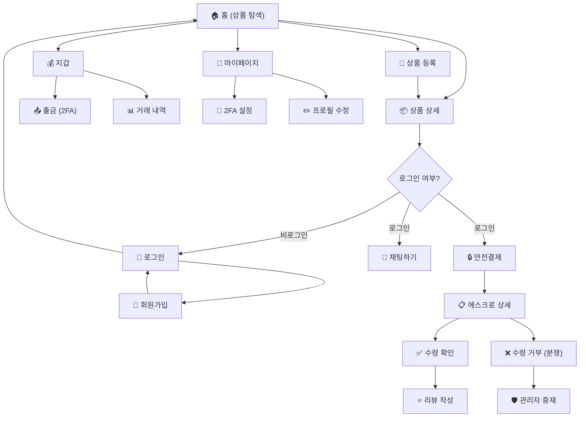

# BCH 중고거래 플랫폼 — UI/UX 스크린 플랜 & 컴포넌트 아키텍처

> **문서 버전**: 1.0  
> **프레임워크**: Leptos (Rust WASM)  
> **라우터**: `leptos_router` (CSR)  
> **상태 관리**: Leptos Signals (`RwSignal`, `Signal::derive`, `Resource`)  

---

## 목차

1. [UX Overview & Design System](#1-ux-overview--design-system)
2. [Core User Flows](#2-core-user-flows)
3. [Detailed Page-by-Page UI & Component Design](#3-detailed-page-by-page-ui--component-design)
   - 3.1 [HomePage](#31-homepage--frontendsrcpageshomers)
   - 3.2 [LoginPage](#32-loginpage--frontendsrcpagesloginrs)
   - 3.3 [SignupPage](#33-signuppage--frontendsrcpagessignuprs)
   - 3.4 [ProductDetailPage](#34-productdetailpage--frontendsrcpagesproduct_detailrs)
   - 3.5 [ProductNewPage](#35-productnewpage--frontendsrcpagesproduct_newrs)
   - 3.6 [ProductEditPage](#36-producteditpage--frontendsrcpagesproduct_editrs)
   - 3.7 [WalletPage](#37-walletpage--frontendsrcpageswalletrs)
   - 3.8 [EscrowPage](#38-escrowpage--frontendsrcpagesescrowrs)
   - 3.9 [ChatPage](#39-chatpage--frontendsrcpageschatrs)
   - 3.10 [MyPage](#310-mypage--frontendsrcpagesmypagers)
   - 3.11 [NotificationsPage](#311-notificationspage--frontendsrcpagesnotificationsrs)
   - 3.12 [AdminPage](#312-adminpage--frontendsrcpagesadminrs)

---

## 1. UX Overview & Design System

### 1.1 핵심 UX 목표

| 목표 | 설명 |
|---|---|
| **신뢰성 (Trust)** | BCH 에스크로 기반 안전결제를 시각적으로 강조하여 거래 불안 해소 |
| **효율성 (Efficiency)** | 검색 → 상세 → 결제까지 3-tap 이내 도달. 불필요한 클릭 최소화 |
| **접근성 (Accessibility)** | 모바일-퍼스트 반응형. 큰 터치 타겟(48px↑), 명확한 대비(WCAG AA) |
| **투명성 (Transparency)** | 에스크로 단계, 수수료, 거래 내역을 실시간으로 명확히 노출 |
| **보안 감각 (Security Feel)** | 2FA, OTP 입력 UI에서 고급 보안 UI/UX 제공 (자물쇠 아이콘, 단계 애니메이션) |

### 1.2 디자인 톤 & 매너

```
시각 키워드: Clean · Trustworthy · Crypto-Native · Premium
참고 벤치마크: 당근마켓(탐색 UX) × Trust Wallet(지갑 UI) × Mercari(에스크로 UX)
```

**컬러 시스템**:

| 토큰 | HEX | 용도 |
|---|---|---|
| `--color-primary` | `#0AC18E` | BCH 그린 — CTA 버튼, 링크, 액센트 |
| `--color-primary-hover` | `#08A57A` | 버튼 호버 상태 |
| `--color-primary-subtle` | `#E6F9F3` | 배지 배경, 알림 하이라이트 |
| `--color-danger` | `#E53E3E` | 분쟁, 삭제, 오류 |
| `--color-warning` | `#F6AD55` | 예약중, 주의 배지 |
| `--color-success` | `#38A169` | 정산 완료, 성공 토스트 |
| `--color-bg-primary` | `#FFFFFF` | 라이트 모드 배경 |
| `--color-bg-secondary` | `#F7FAFC` | 카드/섹션 배경 |
| `--color-bg-dark` | `#1A202C` | 다크 모드 배경 |
| `--color-text-primary` | `#1A202C` | 본문 텍스트 |
| `--color-text-secondary` | `#718096` | 보조 텍스트 |
| `--color-border` | `#E2E8F0` | 카드/입력 테두리 |

**타이포그래피**:

| 요소 | 폰트 | 크기 | 두께 |
|---|---|---|---|
| Heading 1 | Pretendard | 28px | 700 |
| Heading 2 | Pretendard | 22px | 600 |
| Body | Pretendard | 16px | 400 |
| Caption | Pretendard | 13px | 400 |
| Monospace (주소/해시) | JetBrains Mono | 14px | 400 |

**간격 & 레이아웃**:

| 토큰 | 값 | 용도 |
|---|---|---|
| `--spacing-xs` | 4px | 인라인 요소 간격 |
| `--spacing-sm` | 8px | 아이콘-텍스트 간격 |
| `--spacing-md` | 16px | 카드 내부 패딩 |
| `--spacing-lg` | 24px | 섹션 간 간격 |
| `--spacing-xl` | 40px | 페이지 양쪽 여백 |
| `--radius-sm` | 6px | 버튼, 입력 필드 |
| `--radius-md` | 12px | 카드 |
| `--radius-lg` | 20px | 모달 |
| `--radius-full` | 9999px | 아바타, 뱃지 |

---

### 1.3 공통 컴포넌트 설계 (Design System Components)

아래 컴포넌트들은 `frontend/src/components/` 디렉터리에 배치합니다.

#### 1.3.1 Layout 컴포넌트

| 컴포넌트 | 파일 | Props | 설명 |
|---|---|---|---|
| `<AppShell/>` | `app_shell.rs` | `children: Children` | 전체 레이아웃 래퍼. `<NavBar/>` + `<main>` + `<BottomNav/>` |
| `<NavBar/>` | `navbar.rs` | — | 상단 네비게이션: 로고, 검색, 알림 배지, 프로필 메뉴. `AuthStore`와 `NotificationStore` 구독 |
| `<BottomNav/>` | `bottom_nav.rs` | — | 모바일 하단 탭: 홈/채팅/등록/지갑/마이페이지 |
| `<PageContainer/>` | `page_container.rs` | `title: &str, children: Children` | 페이지 공통 래퍼. `<Title>` + padding + max-width |

#### 1.3.2 Data Display 컴포넌트

| 컴포넌트 | 파일 | Props | 설명 |
|---|---|---|---|
| `<ProductCard/>` | `product_card.rs` | `item: ItemSummaryRes` | 홈 그리드의 상품 카드. 썸네일, 제목, 가격, 조회수, 상태 배지 |
| `<StatusBadge/>` | `status_badge.rs` | `state: ItemState` | 판매중(green)/예약중(orange)/판매완료(gray) 배지 |
| `<TradeStepBadge/>` | `trade_step_badge.rs` | `step: TradeStep` | 에스크로 단계 배지 (Deposited/Received/Disputed/Settled/Refunded) |
| `<WalletBalanceCard/>` | `wallet_balance_card.rs` | `balance: f64, locked: f64` | 잔액 카드 (가용/에스크로 잠금 분리 표시) |
| `<TxHistoryRow/>` | `tx_history_row.rs` | `tx: TxHistoryItemRes` | 거래 내역 행 (입금↓/출금↑ 아이콘, 금액, 상태, 시간) |
| `<NotificationItem/>` | `notification_item.rs` | `noti: NotificationRes` | 알림 항목 (아이콘 분기: Chat/Escrow/System/Warning/Report) |
| `<ChatBubble/>` | `chat_bubble.rs` | `msg: ChatMessagePayload, is_mine: bool` | 채팅 말풍선 (좌/우 정렬, 시간 표시) |
| `<UserTrustIndicator/>` | `user_trust.rs` | `reliability_index: f64` | 신뢰도 프로그레스 바 + 수치 |
| `<EmptyState/>` | `empty_state.rs` | `icon: &str, message: &str` | 빈 리스트 안내 (일러스트 + 텍스트) |
| `<StepProgress/>` | `step_progress.rs` | `steps: Vec<&str>, current: usize` | 에스크로 진행 단계 가로 스텝퍼 |
| `<ImageCarousel/>` | `image_carousel.rs` | `urls: Vec<String>` | 상품 이미지 슬라이드 갤러리 (스와이프 지원) |
| `<StatCard/>` | `stat_card.rs` | `label: &str, value: String, icon: &str` | 관리자 통계 수치 카드 |

#### 1.3.3 Input & Form 컴포넌트

| 컴포넌트 | 파일 | Props | 설명 |
|---|---|---|---|
| `<FormInput/>` | `form_input.rs` | `label, placeholder, input_type, signal: RwSignal<String>, error: Signal<Option<String>>` | 레이블 + 입력 필드 + 인라인 에러 메시지 |
| `<FormTextarea/>` | `form_textarea.rs` | `label, placeholder, signal: RwSignal<String>, max_length: usize` | 멀티라인 입력 + 글자 수 카운터 |
| `<PriceInput/>` | `price_input.rs` | `signal: RwSignal<f64>` | BCH 금액 입력 (소수점 처리 + "BCH" 접미사) |
| `<OtpInput/>` | `otp_input.rs` | `signal: RwSignal<String>, length: usize` | 6자리 OTP 코드 입력 (자동 포커스 이동) |
| `<ImageUploader/>` | `image_uploader.rs` | `on_uploaded: Callback<String>` | 드래그 앤 드롭 이미지 업로드 → `POST /uploads` → URL 반환 |
| `<TagInput/>` | `tag_input.rs` | `tags: RwSignal<Vec<String>>` | 태그 칩 입력 (Enter로 추가, X로 삭제) |
| `<CategorySelect/>` | `category_select.rs` | `signal: RwSignal<String>` | 카테고리 드롭다운 |
| `<SearchBar/>` | `search_bar.rs` | `keyword: RwSignal<String>, on_search: Callback<()>` | 아이콘 + 검색 입력 + 디바운스 |
| `<StarRating/>` | `star_rating.rs` | `score: RwSignal<i32>, readonly: bool` | 1~5점 별점 입력/표시 |

#### 1.3.4 Feedback & Overlay 컴포넌트

| 컴포넌트 | 파일 | Props | 설명 |
|---|---|---|---|
| `<Button/>` | `button.rs` | `variant: Primary\|Secondary\|Danger\|Ghost, loading: Signal<bool>, disabled: Signal<bool>` | 공용 버튼 (로딩 스피너 내장) |
| `<Modal/>` | `modal.rs` | `is_open: RwSignal<bool>, title: &str, children: Children` | 오버레이 모달 (ESC/배경 클릭으로 닫기) |
| `<ConfirmDialog/>` | `confirm_dialog.rs` | `message: &str, on_confirm: Callback, on_cancel: Callback` | 확인/취소 다이얼로그 |
| `<Toast/>` | `toast.rs` | 전역 `ToastStore` | 성공/에러/경고 토스트 알림 (3초 자동 소멸) |
| `<LoadingSkeleton/>` | `loading_skeleton.rs` | `variant: Card\|List\|Detail` | 데이터 로딩 중 스켈레톤 UI |
| `<QrCodeDisplay/>` | `qr_code.rs` | `data: String` | BCH 주소/2FA QR 코드 표시 |

---

### 1.4 컴포넌트 디렉터리 구조

```
frontend/src/
├── main.rs                     // App 진입점, Context Provider 설정
├── router.rs                   // 라우트 정의
├── components/
│   ├── mod.rs
│   ├── layout/
│   │   ├── mod.rs
│   │   ├── app_shell.rs        // <AppShell/>
│   │   ├── navbar.rs           // <NavBar/>
│   │   ├── bottom_nav.rs       // <BottomNav/>
│   │   └── page_container.rs   // <PageContainer/>
│   ├── display/
│   │   ├── mod.rs
│   │   ├── product_card.rs     // <ProductCard/>
│   │   ├── status_badge.rs     // <StatusBadge/>
│   │   ├── trade_step_badge.rs // <TradeStepBadge/>
│   │   ├── wallet_balance_card.rs
│   │   ├── tx_history_row.rs
│   │   ├── notification_item.rs
│   │   ├── chat_bubble.rs
│   │   ├── user_trust.rs
│   │   ├── empty_state.rs
│   │   ├── step_progress.rs
│   │   ├── image_carousel.rs
│   │   └── stat_card.rs
│   ├── input/
│   │   ├── mod.rs
│   │   ├── form_input.rs       // <FormInput/>
│   │   ├── form_textarea.rs
│   │   ├── price_input.rs
│   │   ├── otp_input.rs
│   │   ├── image_uploader.rs
│   │   ├── tag_input.rs
│   │   ├── category_select.rs
│   │   ├── search_bar.rs
│   │   └── star_rating.rs
│   └── feedback/
│       ├── mod.rs
│       ├── button.rs           // <Button/>
│       ├── modal.rs            // <Modal/>
│       ├── confirm_dialog.rs
│       ├── toast.rs
│       ├── loading_skeleton.rs
│       └── qr_code.rs
├── models/                     // (기존) 반응형 상태
│   ├── mod.rs
│   ├── auth_model.rs
│   ├── escrow_model.rs
│   ├── notification_store.rs
│   ├── product_model.rs
│   └── wallet_model.rs
└── pages/                      // (기존) 페이지 컴포넌트
    ├── mod.rs
    ├── home.rs
    ├── login.rs
    ├── signup.rs
    ├── product_detail.rs
    ├── product_new.rs
    ├── product_edit.rs
    ├── wallet.rs
    ├── escrow.rs
    ├── chat.rs
    ├── mypage.rs
    ├── notifications.rs
    └── admin.rs
```

---

## 2. Core User Flows

### 2.1 주요 유저 저니 맵



### 2.2 플로우별 상세 시나리오 & 에러 처리 UI

#### Flow 1: 회원가입 → 로그인

| 단계 | 사용자 행동 | API | 성공 UI | 에러 UI |
|---|---|---|---|---|
| 1 | `/signup` 접속, 아이디/비밀번호/이메일 입력 | — | 인증코드 전송 버튼 활성화 | `FormInput` 인라인 검증 오류 (3자 미만, 8자 미만 등) |
| 2 | "인증코드 전송" 클릭 | — | 토스트: "인증코드가 전송되었습니다" | 토스트(error): "이메일 형식이 올바르지 않습니다" |
| 3 | 인증코드 입력 후 "가입하기" | `POST /auth/signup` | 토스트(success) + `/login`으로 리다이렉트 | **409**: "이미 사용 중인 아이디/이메일입니다" (인라인 에러) |
| 4 | 로그인 폼 입력 후 제출 | `POST /auth/login` | `AuthStore.login()` → 홈으로 이동 | **401**: "아이디 또는 비밀번호가 올바르지 않습니다" (인라인 에러) |

#### Flow 2: 상품 탐색 → 구매 (에스크로)

| 단계 | 사용자 행동 | API | 성공 UI | 에러 UI |
|---|---|---|---|---|
| 1 | 홈에서 검색/카테고리 필터 | `GET /products?keyword=...` | 상품 그리드 갱신 (Suspense → 스켈레톤) | 빈 결과: `<EmptyState>` "검색 결과가 없습니다" |
| 2 | 상품 카드 클릭 | `GET /products/{item_uid}` | 상세 페이지 렌더링 | **404**: "상품을 찾을 수 없습니다" + 홈으로 돌아가기 버튼 |
| 3 | "안전결제" 버튼 클릭 | `POST /escrow` | `/escrow/{trade_uid}`로 이동 | **400**: "잔액이 부족합니다" → 지갑 충전 유도 모달 |
|   |  |  |  | **400**: "본인 상품은 구매할 수 없습니다" → 토스트(warning) |
|   |  |  |  | **409**: "이미 진행 중인 거래가 있습니다" → 기존 거래 페이지 링크 |
| 4 | 에스크로 페이지에서 "수령 확인" | `POST /escrow/{trade_uid}/confirm` | `StepProgress` → "정산 완료" + 리뷰 작성 폼 표시 | **403**: "구매자만 수령 확인할 수 있습니다" |
| 5 | 또는 "수령 거부" + 사유 입력 | `POST /escrow/{trade_uid}/dispute` | `StepProgress` → "분쟁 진행 중" (빨간 배지) | **400**: "사유를 10자 이상 입력해주세요" (인라인 검증) |

#### Flow 3: 상품 등록

| 단계 | 사용자 행동 | API | 성공 UI | 에러 UI |
|---|---|---|---|---|
| 1 | 이미지 업로드 (드래그 앤 드롭) | `POST /uploads` | 썸네일 미리보기 표시 | **413**: "파일 크기가 5MB를 초과합니다" (토스트) |
|   |  |  |  | **400**: "지원하지 않는 파일 형식입니다" (토스트) |
| 2 | 상품 정보 입력 후 "등록하기" | `POST /products` | `/products/{item_uid}`로 이동 + 토스트(success) | **400**: 필수 필드 누락 (인라인 검증) |

#### Flow 4: 지갑 출금 (2FA 필수)

| 단계 | 사용자 행동 | API | 성공 UI | 에러 UI |
|---|---|---|---|---|
| 1 | "출금하기" 클릭 | — | 출금 모달 오픈 | — |
| 2 | 주소/금액/OTP 입력 후 제출 | `POST /wallet/withdraw` | 토스트(success) + 거래 내역 갱신 | **400**: "잔액이 부족합니다" |
|   |  |  |  | **400**: "BCH 주소가 유효하지 않습니다" |
|   |  |  |  | **400**: "OTP 코드가 올바르지 않습니다" |

#### Flow 5: 채팅

| 단계 | 사용자 행동 | API | 성공 UI | 에러 UI |
|---|---|---|---|---|
| 1 | 상품 상세에서 "채팅하기" 클릭 | `POST /chat/rooms` | `/chat` 이동 + 채팅방 활성화 | **404**: "상대방을 찾을 수 없습니다" |
| 2 | 메시지 입력 후 전송 | `WS: SendMessageReq` | 메시지 즉시 표시 (낙관적 업데이트) | WebSocket 연결 실패: 재연결 배너 표시 |
| 3 | 이전 대화 내역 로드 | `GET /chat/rooms/{room_uid}/history` | 메시지 목록 렌더링 | **403**: "채팅방 참여자가 아닙니다" |

#### Flow 6: 관리자 운영

| 단계 | 사용자 행동 | API | 성공 UI | 에러 UI |
|---|---|---|---|---|
| 1 | `/admin` 접근 | `AuthStore.is_admin` 체크 | 관리자 대시보드 | 비관리자: 즉시 `/`로 리다이렉트 |
| 2 | 통계 조회 | `GET /admin/stats` | `StatCard` 그리드 렌더링 | **403**: 접근 거부 |
| 3 | 분쟁 강제 정산 | `POST /admin/escrow/force-settle` | 토스트(success) + 목록 갱신 | **404**: "거래를 찾을 수 없습니다" |

---

## 3. Detailed Page-by-Page UI & Component Design

---

### 3.1 HomePage — `frontend/src/pages/home.rs`

**라우트**: `/`  
**접근 제한**: 없음 (Public)

#### 스크린 레이아웃

```
┌──────────────────────────────────────────────┐
│  <NavBar/>                                   │
├──────────────────────────────────────────────┤
│  <SearchBar/>                                │
│  ┌──────────────────────────────────────┐    │
│  │  <CategoryChipRow/>                  │    │
│  │  [전체] [전자기기] [의류] [도서] ... │    │
│  └──────────────────────────────────────┘    │
├──────────────────────────────────────────────┤
│  <ProductGrid>                               │
│    ┌─────────┐ ┌─────────┐ ┌─────────┐      │
│    │<Product │ │<Product │ │<Product │      │
│    │ Card/>  │ │ Card/>  │ │ Card/>  │      │
│    │ 📷      │ │ 📷      │ │ 📷      │      │
│    │ 에어팟   │ │ 키보드   │ │ 가방    │      │
│    │ 0.5 BCH │ │ 0.3 BCH │ │ 1.2 BCH │      │
│    │ 👁 124  │ │ 👁 56   │ │ 👁 203  │      │
│    └─────────┘ └─────────┘ └─────────┘      │
│    ... (무한 스크롤 or 페이지네이션)          │
│  </ProductGrid>                              │
├──────────────────────────────────────────────┤
│  <BottomNav/>                                │
└──────────────────────────────────────────────┘
```

#### 필요 서브 컴포넌트

| 컴포넌트 | 용도 |
|---|---|
| `<SearchBar/>` | 검색어 입력. 300ms 디바운스로 `keyword` Signal 업데이트 |
| `<CategoryChipRow/>` | 가로 스크롤 카테고리 칩. 클릭 시 `category` Signal 업데이트 |
| `<ProductCard/>` | 상품 요약 카드. 클릭 시 `/products/{item_uid}`로 이동 |
| `<LoadingSkeleton variant="Card"/>` | 상품 데이터 로딩 중 표시 |
| `<EmptyState/>` | 검색 결과 없음 시 표시 |

#### 연관 API & DTO

| API | DTO | 설명 |
|---|---|---|
| `GET /products` | Query: `ProductSearchQuery` → Response: `Vec<ItemSummaryRes>` | 검색/필터 결과 |

#### 상태 관리 (Signals)

```rust
// 검색 상태
keyword: RwSignal<String>               // 검색어 입력
category: RwSignal<Option<String>>       // 카테고리 필터
current_page: RwSignal<u64>              // 페이지네이션

// API 연동
products: Resource<(String, Option<String>, u64), Vec<ItemSummaryRes>>
    // deps: (keyword, category, page) → GET /products

// UI 상태
is_search_focused: RwSignal<bool>        // 검색바 포커스 애니메이션
```

---

### 3.2 LoginPage — `frontend/src/pages/login.rs`

**라우트**: `/login`  
**접근 제한**: 없음 (비로그인 시에만 표시, 로그인 상태면 `/`로 리다이렉트)

#### 스크린 레이아웃

```
┌──────────────────────────────────────────────┐
│                                              │
│          ┌─────────────────────┐             │
│          │       🔗 로고       │             │
│          │                     │             │
│          │  ┌───────────────┐  │             │
│          │  │ <FormInput/>  │  │             │
│          │  │ 아이디         │  │             │
│          │  └───────────────┘  │             │
│          │  ┌───────────────┐  │             │
│          │  │ <FormInput/>  │  │             │
│          │  │ 비밀번호 ****  │  │             │
│          │  └───────────────┘  │             │
│          │                     │             │
│          │  [에러 메시지 영역]   │             │
│          │                     │             │
│          │  ┌───────────────┐  │             │
│          │  │ <Button/>     │  │             │
│          │  │ "로그인"      │  │             │
│          │  └───────────────┘  │             │
│          │                     │             │
│          │  "계정이 없으신가요?" │             │
│          │   → 회원가입 링크    │             │
│          └─────────────────────┘             │
│                                              │
└──────────────────────────────────────────────┘
```

#### 필요 서브 컴포넌트

| 컴포넌트 | 용도 |
|---|---|
| `<FormInput/>` | 아이디 입력 (type="text") |
| `<FormInput/>` | 비밀번호 입력 (type="password") |
| `<Button variant="Primary"/>` | 로그인 제출 (로딩 스피너 포함) |

#### 연관 API & DTO

| API | DTO | 설명 |
|---|---|---|
| `POST /auth/login` | Request: `LoginReq` → Response: `AuthTokenRes` | JWT 토큰 발급 |
| `GET /users/me` | Response: `UserProfileRes` | 로그인 후 프로필 조회 |

#### 상태 관리 (Signals)

```rust
account_id: RwSignal<String>
secret_key: RwSignal<String>
error_msg: RwSignal<Option<String>>      // API 에러 메시지
is_submitting: RwSignal<bool>            // 버튼 로딩 상태

// Context
auth_store: AuthStore                    // use_context로 접근
navigate: NavigateFn                     // 로그인 성공 시 이동
```

---

### 3.3 SignupPage — `frontend/src/pages/signup.rs`

**라우트**: `/signup`  
**접근 제한**: 없음 (비로그인 시에만)

#### 스크린 레이아웃

```
┌──────────────────────────────────────────────┐
│          ┌─────────────────────┐             │
│          │       📝 회원가입    │             │
│          │                     │             │
│          │  <FormInput/> 아이디 │             │
│          │  <FormInput/> 비밀번호│             │
│          │  <FormInput/> 이메일  │             │
│          │                     │             │
│          │  ┌────────────────┐ │             │
│          │  │ [인증코드 전송] │ │             │
│          │  └────────────────┘ │             │
│          │                     │             │
│          │  <FormInput/> 인증코드│             │
│          │                     │             │
│          │  [에러 메시지 영역]   │             │
│          │                     │             │
│          │  <Button/> "가입하기" │             │
│          │                     │             │
│          │  "이미 계정이 있으신가요?"│           │
│          │   → 로그인 링크       │             │
│          └─────────────────────┘             │
└──────────────────────────────────────────────┘
```

#### 필요 서브 컴포넌트

| 컴포넌트 | 용도 |
|---|---|
| `<FormInput/>` × 4 | 아이디, 비밀번호, 이메일, 인증코드 입력 |
| `<Button variant="Secondary"/>` | 인증코드 전송 (쿨다운 타이머 표시) |
| `<Button variant="Primary"/>` | 가입 제출 |

#### 연관 API & DTO

| API | DTO | 설명 |
|---|---|---|
| `POST /auth/signup` | Request: `SignUpReq` → Response: `201 Created` | 회원가입 |

#### 상태 관리 (Signals)

```rust
account_id: RwSignal<String>
secret_key: RwSignal<String>
contact_email: RwSignal<String>
verification_code: RwSignal<String>
error_msg: RwSignal<Option<String>>
is_submitting: RwSignal<bool>
verification_sent: RwSignal<bool>        // 인증코드 전송 여부
cooldown_seconds: RwSignal<u32>          // 재전송 대기 카운트다운
```

**클라이언트측 유효성 검증**:
- `account_id`: 3~50자 → 미충족 시 인라인 에러
- `secret_key`: 8자 이상 → 미충족 시 인라인 에러
- `contact_email`: 이메일 형식 검증

---

### 3.4 ProductDetailPage — `frontend/src/pages/product_detail.rs`

**라우트**: `/products/:item_uid`  
**접근 제한**: 조회는 Public / 구매·채팅·신고는 로그인 필요

#### 스크린 레이아웃

```
┌──────────────────────────────────────────────┐
│  <NavBar/>  ← 뒤로가기                       │
├──────────────────────────────────────────────┤
│  ┌──────────────────────────────────────┐    │
│  │ <ImageCarousel/>                     │    │
│  │  [ 📷 1/5 ]  ← →                    │    │
│  └──────────────────────────────────────┘    │
├──────────────────────────────────────────────┤
│  <StatusBadge state="on_sale"/>  판매중       │
│  <h1>  에어팟 프로 미개봉  </h1>              │
│  <span class="price">  0.5 BCH  </span>     │
│  <span class="meta"> 👁 124  ·  2분 전 </span>│
├──────────────────────────────────────────────┤
│  ┌──────────────────────────────────────┐    │
│  │ 판매자 정보                           │    │
│  │ <UserTrustIndicator/> 신뢰도 85%     │    │
│  └──────────────────────────────────────┘    │
├──────────────────────────────────────────────┤
│  <section class="description">               │
│    상품 설명 본문 (detail_body)               │
│  </section>                                  │
│                                              │
│  <div class="tags">                          │
│    #에어팟  #애플  #무선이어폰                 │
│  </div>                                      │
├──────────────────────────────────────────────┤
│  <div class="action-buttons">  (sticky 하단) │
│    ┌──────────────┐ ┌──────────────┐        │
│    │ 💬 채팅하기   │ │ 🔒 안전결제  │        │
│    └──────────────┘ └──────────────┘        │
│  </div>                                      │
├──────────────────────────────────────────────┤
│  <details>  ▸ 신고하기                       │
│    <FormTextarea/> 신고 사유                  │
│    <Button variant="Danger"/> "신고 제출"     │
│  </details>                                  │
├──────────────────────────────────────────────┤
│  <BottomNav/>                                │
└──────────────────────────────────────────────┘
```

#### 필요 서브 컴포넌트

| 컴포넌트 | 용도 |
|---|---|
| `<ImageCarousel/>` | 상품 이미지 슬라이드 (image_urls) |
| `<StatusBadge/>` | 판매 상태 배지 |
| `<UserTrustIndicator/>` | 판매자 신뢰도 표시 |
| `<Button/>` × 2 | "채팅하기" (Secondary), "안전결제" (Primary) |
| `<FormTextarea/>` | 신고 사유 입력 |
| `<Button variant="Danger"/>` | 신고 제출 |
| `<LoadingSkeleton variant="Detail"/>` | 로딩 중 스켈레톤 |

#### 연관 API & DTO

| API | DTO | 설명 |
|---|---|---|
| `GET /products/{item_uid}` | Response: `ItemDetailRes` | 상품 상세 조회 |
| `POST /escrow` | Request: `InitiateEscrowReq` → Response: `SafeTradeStatusRes` | 에스크로 예치 시작 |
| `POST /chat/rooms` | Request: `CreateChatRoomReq` → Response: `ChatRoomRes` | 채팅방 생성/진입 |
| `POST /products/{item_uid}/reports` | Request: `SubmitReportReq` → Response: `ReportAckRes` | 신고 접수 |

#### 상태 관리 (Signals)

```rust
// 라우트 파라미터
item_uid: Memo<String>                   // use_params_map()에서 파생

// API 리소스
product: Resource<String, Option<ItemDetailRes>>
    // deps: item_uid → GET /products/{item_uid}

// UI 모델 (Resource 로드 후 생성)
product_ui: RwSignal<Option<ProductUIState>>
    // ProductUIState::from_dto(dto) → is_available, state_badge 파생

// 신고 폼 상태
report_cause: RwSignal<String>
is_report_submitting: RwSignal<bool>

// 에스크로 시작 상태
is_escrow_loading: RwSignal<bool>

// 조건부 렌더링
is_own_product: Signal<bool>             // owner_uid == current_user.user_uid 비교
show_action_buttons: Signal<bool>        // !is_own_product && is_available
```

---

### 3.5 ProductNewPage — `frontend/src/pages/product_new.rs`

**라우트**: `/products/new`  
**접근 제한**: 로그인 필수 (미로그인 → `/login`으로 리다이렉트)

#### 스크린 레이아웃

```
┌──────────────────────────────────────────────┐
│  <NavBar/>                                   │
├──────────────────────────────────────────────┤
│  <h1> 📦 상품 등록 </h1>                     │
│                                              │
│  <form>                                      │
│    ┌──────────────────────────────────────┐  │
│    │ <ImageUploader/>                     │  │
│    │  [📷 사진 추가 (최대 5장)]            │  │
│    │  ┌────┐ ┌────┐ ┌────┐              │  │
│    │  │ 1  │ │ 2  │ │ +  │              │  │
│    │  └────┘ └────┘ └────┘              │  │
│    └──────────────────────────────────────┘  │
│                                              │
│    <FormInput/> 상품명                       │
│    <FormTextarea/> 상품 설명                  │
│    <PriceInput/> 가격 (BCH)                  │
│    <CategorySelect/> 카테고리                │
│    <TagInput/> 태그                          │
│                                              │
│    <Button variant="Primary"/> "등록하기"     │
│  </form>                                     │
├──────────────────────────────────────────────┤
│  <BottomNav/>                                │
└──────────────────────────────────────────────┘
```

#### 필요 서브 컴포넌트

| 컴포넌트 | 용도 |
|---|---|
| `<ImageUploader/>` | 멀티 이미지 업로드 (POST /uploads → URL 수집) |
| `<FormInput/>` | 상품명 |
| `<FormTextarea/>` | 상품 설명 (글자 수 카운터 포함, max 5000) |
| `<PriceInput/>` | BCH 가격 입력 |
| `<CategorySelect/>` | 카테고리 선택 드롭다운 |
| `<TagInput/>` | 태그 칩 입력 |
| `<Button/>` | 등록 제출 |

#### 연관 API & DTO

| API | DTO | 설명 |
|---|---|---|
| `POST /uploads` | Request: `multipart/form-data` → Response: `{ image_url }` | 이미지 업로드 |
| `POST /products` | Request: `CreateItemReq` → Response: `{ item_uid }` | 상품 등록 |

#### 상태 관리 (Signals)

```rust
heading: RwSignal<String>
detail_body: RwSignal<String>
asking_price: RwSignal<f64>
group_category: RwSignal<String>
tags: RwSignal<Vec<String>>
uploaded_image_urls: RwSignal<Vec<String>>  // ImageUploader에서 수집

is_submitting: RwSignal<bool>
error_msg: RwSignal<Option<String>>

// 유효성 검증 파생 시그널
is_form_valid: Signal<bool>
    // heading.len() >= 2 && detail_body.len() >= 1 && asking_price > 0 && ...
```

---

### 3.6 ProductEditPage — `frontend/src/pages/product_edit.rs`

**라우트**: `/products/:item_uid/edit`  
**접근 제한**: 로그인 필수 + 본인 상품만 (IDOR 방지)

#### 스크린 레이아웃

```
┌──────────────────────────────────────────────┐
│  <NavBar/>  ← 뒤로가기                       │
├──────────────────────────────────────────────┤
│  <h1> ✏️ 상품 수정 </h1>                     │
│                                              │
│  <section class="edit-form">                 │
│    (ProductNewPage와 동일한 폼 구조,          │
│     기존 데이터 프리필)                        │
│    <Button/> "수정 완료"                      │
│  </section>                                  │
│                                              │
│  <hr/>                                       │
│                                              │
│  <section class="state-change">              │
│    <h2> 📊 상품 상태 변경 </h2>               │
│    ┌──────────────────────────────────────┐  │
│    │ <StatusBadge/> 현재: 판매중           │  │
│    │                                      │  │
│    │ <select>                             │  │
│    │   판매중 / 예약중 / 판매완료           │  │
│    │ </select>                            │  │
│    │                                      │  │
│    │ <Button/> "상태 변경"                 │  │
│    └──────────────────────────────────────┘  │
│  </section>                                  │
├──────────────────────────────────────────────┤
│  <BottomNav/>                                │
└──────────────────────────────────────────────┘
```

#### 필요 서브 컴포넌트

| 컴포넌트 | 용도 |
|---|---|
| `<FormInput/>`, `<FormTextarea/>`, `<PriceInput/>`, `<CategorySelect/>`, `<TagInput/>` | 기존 정보 프리필된 수정 폼 |
| `<StatusBadge/>` | 현재 상태 표시 |
| `<Button/>` × 2 | "수정 완료", "상태 변경" |

#### 연관 API & DTO

| API | DTO | 설명 |
|---|---|---|
| `GET /products/{item_uid}` | Response: `ItemDetailRes` | 기존 정보 로드 |
| `PUT /products/{item_uid}` | Request: `UpdateItemReq` | 상품 정보 수정 |
| `PATCH /products/{item_uid}/status` | Request: `UpdateItemStateReq` | 상태 변경 |

#### 상태 관리 (Signals)

```rust
// 라우트 파라미터
item_uid: Memo<String>

// 기존 데이터 로드
existing_product: Resource<String, Option<ItemDetailRes>>

// 폼 상태 (기존 데이터로 초기화)
heading: RwSignal<String>
detail_body: RwSignal<String>
asking_price: RwSignal<f64>
group_category: RwSignal<String>
tags: RwSignal<Vec<String>>

// 상태 변경
current_state_input: RwSignal<String>    // select 값

is_submitting: RwSignal<bool>
error_msg: RwSignal<Option<String>>
```

---

### 3.7 WalletPage — `frontend/src/pages/wallet.rs`

**라우트**: `/wallet`, `/wallet/withdraw`  
**접근 제한**: 로그인 필수

#### 스크린 레이아웃

```
┌──────────────────────────────────────────────┐
│  <NavBar/>                                   │
├──────────────────────────────────────────────┤
│  <h1> 💰 지갑 대시보드 </h1>                  │
│                                              │
│  ┌──────────────────────────────────────┐    │
│  │ <WalletBalanceCard/>                 │    │
│  │  ┌─────────────┐ ┌─────────────┐    │    │
│  │  │ 가용 잔액    │ │ 에스크로 잠금│    │    │
│  │  │ 1.234 BCH   │ │ 0.500 BCH  │    │    │
│  │  └─────────────┘ └─────────────┘    │    │
│  │  출금 가능: 0.734 BCH               │    │
│  └──────────────────────────────────────┘    │
│                                              │
│  ┌──────────────────────────────────────┐    │
│  │ 📥 입금 주소                         │    │
│  │  <QrCodeDisplay/>                    │    │
│  │  bitcoincash:qr3m...xk7  [복사 📋]   │    │
│  └──────────────────────────────────────┘    │
│                                              │
│  <Button variant="Primary"/> "📤 출금하기"   │
│                                              │
│  ┌──────────────────────────────────────┐    │
│  │ 📊 거래 내역                         │    │
│  │  <TxHistoryRow/> ↓ 입금  +0.5 BCH   │    │
│  │  <TxHistoryRow/> ↑ 출금  -0.1 BCH   │    │
│  │  <TxHistoryRow/> 🔒 에스크로 잠금     │    │
│  │  <TxHistoryRow/> 🔓 에스크로 해제     │    │
│  │  ...                                 │    │
│  └──────────────────────────────────────┘    │
├──────────────────────────────────────────────┤
│  <BottomNav/>                                │
└──────────────────────────────────────────────┘

─── 출금 모달 (show_withdraw_modal == true) ───

┌──────────────────────────────────────────────┐
│  ▓▓▓▓▓▓▓▓ 오버레이 배경 ▓▓▓▓▓▓▓▓            │
│    ┌────────────────────────────────┐        │
│    │ <Modal title="출금 신청">      │        │
│    │                                │        │
│    │  <FormInput/> 수신 BCH 주소    │        │
│    │  <PriceInput/> 출금 금액       │        │
│    │                                │        │
│    │  예상 수수료: 0.0001 BCH       │        │
│    │  실수령액: 0.0999 BCH          │        │
│    │                                │        │
│    │  ──── 2FA 인증 ────            │        │
│    │  <OtpInput length=6/>          │        │
│    │  [ _ ][ _ ][ _ ][ _ ][ _ ][ _ ]│        │
│    │                                │        │
│    │  <Button/> "출금 확인"          │        │
│    └────────────────────────────────┘        │
└──────────────────────────────────────────────┘
```

#### 필요 서브 컴포넌트

| 컴포넌트 | 용도 |
|---|---|
| `<WalletBalanceCard/>` | 가용 잔액 / 에스크로 잠금 / 출금 가능 금액 표시 |
| `<QrCodeDisplay/>` | BCH 입금 주소 QR 코드 |
| `<TxHistoryRow/>` | 거래 내역 행 (아이콘+금액+상태+시간) |
| `<Modal/>` | 출금 모달 래퍼 |
| `<FormInput/>` | 수신 주소 |
| `<PriceInput/>` | 출금 금액 |
| `<OtpInput/>` | 6자리 OTP 코드 |
| `<Button/>` | "출금하기", "출금 확인" |
| `<EmptyState/>` | 거래 내역 없음 |

#### 연관 API & DTO

| API | DTO | 설명 |
|---|---|---|
| `GET /wallet` | Response: `WalletStateRes` | 잔액 조회 |
| `GET /wallet/history` | Response: `Vec<TxHistoryItemRes>` | 거래 내역 |
| `POST /wallet/withdraw` | Request: `WithdrawReq` | 출금 실행 |

#### 상태 관리 (Signals)

```rust
// WalletUIState (models/wallet_model.rs)로 관리
wallet_state: WalletUIState              // Context 또는 로컬
    // .public_address, .available_balance, .locked_in_escrow
    // .withdrawable (파생), .tx_history, .is_loading

// 출금 모달 상태
show_withdraw_modal: RwSignal<bool>
withdraw_address: RwSignal<String>
withdraw_amount: RwSignal<f64>
otp_token: RwSignal<String>
estimated_fee: RwSignal<f64>
is_withdraw_submitting: RwSignal<bool>
withdraw_error: RwSignal<Option<String>>

// API 리소스
wallet_resource: Resource<(), WalletStateRes>
history_resource: Resource<(), Vec<TxHistoryItemRes>>
```

---

### 3.8 EscrowPage — `frontend/src/pages/escrow.rs`

**라우트**: `/escrow/:trade_uid`  
**접근 제한**: 로그인 필수 (거래 당사자만 접근 가능)

#### 스크린 레이아웃

```
┌──────────────────────────────────────────────┐
│  <NavBar/>  ← 뒤로가기                       │
├──────────────────────────────────────────────┤
│  <h1> 🔒 안전결제 </h1>                      │
│                                              │
│  ┌──────────────────────────────────────┐    │
│  │ <StepProgress                        │    │
│  │   steps=["예치", "수령확인", "정산"]   │    │
│  │   current={step에 따라 0~2}/>         │    │
│  │                                      │    │
│  │  ● 예치 ────● 수령확인 ────○ 정산     │    │
│  └──────────────────────────────────────┘    │
│                                              │
│  ┌──────────────────────────────────────┐    │
│  │ 거래 정보 카드                        │    │
│  │  <TradeStepBadge step="deposited"/>  │    │
│  │  예치 금액: 0.500 BCH               │    │
│  │  자동 정산 기한: 2026-07-29 16:00    │    │
│  │  거래 ID: trade_abc123              │    │
│  └──────────────────────────────────────┘    │
│                                              │
│  ── step == Deposited (구매자 뷰) ──         │
│  ┌──────────────────────────────────────┐    │
│  │ <section class="buyer-actions">      │    │
│  │  "상품을 수령하셨나요?"               │    │
│  │                                      │    │
│  │  <Button variant="Primary">          │    │
│  │    "✅ 수령 확인"                     │    │
│  │  </Button>                           │    │
│  │                                      │    │
│  │  <Button variant="Danger">           │    │
│  │    "❌ 수령 거부"                     │    │
│  │  </Button>                           │    │
│  └──────────────────────────────────────┘    │
│                                              │
│  ── 수령 거부 클릭 시 확장 ──                 │
│  ┌──────────────────────────────────────┐    │
│  │ <FormTextarea/> 거부 사유 (10자 이상) │    │
│  │ <Button variant="Danger"> "분쟁 접수" │    │
│  └──────────────────────────────────────┘    │
│                                              │
│  ── step == Settled (완료 뷰) ──             │
│  ┌──────────────────────────────────────┐    │
│  │ <section class="review-form">        │    │
│  │  <h2> ⭐ 거래 후기 작성 </h2>         │    │
│  │  <StarRating score={review_score}/>  │    │
│  │  <FormTextarea/> 후기 내용            │    │
│  │  <Button variant="Primary"> "제출"   │    │
│  └──────────────────────────────────────┘    │
├──────────────────────────────────────────────┤
│  <BottomNav/>                                │
└──────────────────────────────────────────────┘
```

#### 필요 서브 컴포넌트

| 컴포넌트 | 용도 |
|---|---|
| `<StepProgress/>` | 에스크로 3단계 진행 표시 (예치→수령확인→정산) |
| `<TradeStepBadge/>` | 현재 거래 단계 배지 |
| `<Button/>` × 3 | 수령 확인, 수령 거부, 분쟁 접수 |
| `<FormTextarea/>` | 분쟁 사유 입력 (min 10자 검증) |
| `<StarRating/>` | 1~5점 별점 입력 |
| `<FormTextarea/>` | 리뷰 후기 입력 |
| `<ConfirmDialog/>` | "수령 확인" 전 최종 확인 다이얼로그 |

#### 연관 API & DTO

| API | DTO | 설명 |
|---|---|---|
| `POST /escrow/{trade_uid}/confirm` | — | 수령 확인 (정산) |
| `POST /escrow/{trade_uid}/dispute` | Request: `DisputeEscrowReq` | 수령 거부 (분쟁) |
| `POST /escrow/{trade_uid}/reviews` | Request: `SubmitReviewReq` | 리뷰 작성 |

#### 상태 관리 (Signals)

```rust
// 라우트 파라미터
trade_uid: Memo<String>

// EscrowUIState (models/escrow_model.rs)
escrow_state: RwSignal<Option<EscrowUIState>>
    // .step, .locked_funds, .auto_finalize_deadline
    // .is_action_required (파생: step == Deposited)
    // .is_disputed (파생: step == Disputed)
    // .is_settled (파생: step == Settled)

// 분쟁 폼
dispute_reason: RwSignal<String>
show_dispute_form: RwSignal<bool>

// 리뷰 폼
review_score: RwSignal<i32>             // 1~5, 기본 5
review_feedback: RwSignal<String>

// UI 상태
is_confirming: RwSignal<bool>            // 수령 확인 로딩
is_disputing: RwSignal<bool>             // 분쟁 접수 로딩
is_reviewing: RwSignal<bool>             // 리뷰 제출 로딩

// 역할 판별
is_buyer: Signal<bool>                   // current_user == buyer_uid
is_seller: Signal<bool>                  // current_user == seller_uid
```

---

### 3.9 ChatPage — `frontend/src/pages/chat.rs`

**라우트**: `/chat`  
**접근 제한**: 로그인 필수

#### 스크린 레이아웃

```
┌──────────────────────────────────────────────┐
│  <NavBar/>                                   │
├────────────┬─────────────────────────────────┤
│ <aside>    │ <section class="chat-window">   │
│ 채팅방 목록 │                                │
│            │  ┌── 상대방 정보 헤더 ──┐        │
│ ┌────────┐ │  │ 사용자A · 에어팟 프로 │        │
│ │ 방 1   │ │  └────────────────────┘        │
│ │ [●] 읽 │ │                                │
│ │ 안 읽음 │ │  ┌───────────────────┐         │
│ └────────┘ │  │  <ChatBubble/>     │         │
│ ┌────────┐ │  │  (상대방 메시지)    │         │
│ │ 방 2   │ │  └───────────────────┘         │
│ │        │ │         ┌───────────────────┐  │
│ └────────┘ │         │  <ChatBubble/>     │  │
│ ...        │         │  (내 메시지)       │  │
│            │         └───────────────────┘  │
│            │                                │
│            │  ┌────────────────────────────┐│
│            │  │ <form>                     ││
│            │  │  <input/> │ <Button 전송>  ││
│            │  └────────────────────────────┘│
├────────────┴─────────────────────────────────┤
│  <BottomNav/>  (모바일: 방 목록 ↔ 채팅 토글)  │
└──────────────────────────────────────────────┘
```

#### 모바일 반응형 전략

- **Desktop (≥768px)**: 좌측 채팅방 목록 + 우측 채팅 윈도우 (Split View)
- **Mobile (<768px)**: 
  - 기본: 채팅방 목록 풀스크린
  - 방 선택 시: 채팅 윈도우 풀스크린 (← 뒤로가기로 목록 복귀)

#### 필요 서브 컴포넌트

| 컴포넌트 | 용도 |
|---|---|
| `<ChatRoomListItem/>` | 채팅방 항목 (상대방 이름, 최신 메시지 미리보기, 안 읽은 메시지 카운트) |
| `<ChatBubble/>` | 메시지 말풍선 (좌/우, 시간 표시) |
| `<FormInput/>` | 메시지 입력 |
| `<Button/>` | 전송 버튼 |
| `<EmptyState/>` | 채팅방 없음 / 메시지 없음 |
| `<ConnectionStatus/>` | WebSocket 연결 상태 표시 (연결됨/재연결 중) |

#### 연관 API & DTO

| API | DTO | 설명 |
|---|---|---|
| `POST /chat/rooms` | Request: `CreateChatRoomReq` → Response: `{ room_uid }` | 채팅방 생성 |
| `GET /chat/rooms/{room_uid}/history` | Response: `Vec<ChatMessagePayload>` | 이전 메시지 로드 |
| `GET /chat/ws` (WebSocket) | Send: `SendMessageReq`, Recv: `ChatMessagePayload` | 실시간 메시지 |

#### 상태 관리 (Signals)

```rust
// 채팅방 목록
rooms: RwSignal<Vec<ChatRoomRes>>        // TODO: 채팅방 목록 API 필요
active_room_uid: RwSignal<Option<String>>

// 메시지
messages: RwSignal<Vec<ChatMessagePayload>>
msg_input: RwSignal<String>

// WebSocket
ws_connected: RwSignal<bool>             // 연결 상태
ws_reconnect_count: RwSignal<u32>        // 재연결 시도 횟수

// 모바일 UI
show_chat_window: RwSignal<bool>         // 모바일에서 채팅방↔메시지 토글

// 스크롤
should_scroll_bottom: RwSignal<bool>     // 새 메시지 수신 시 자동 스크롤
```

---

### 3.10 MyPage — `frontend/src/pages/mypage.rs`

**라우트**: `/mypage`  
**접근 제한**: 로그인 필수

#### 스크린 레이아웃

```
┌──────────────────────────────────────────────┐
│  <NavBar/>                                   │
├──────────────────────────────────────────────┤
│  <h1> 👤 마이페이지 </h1>                    │
│                                              │
│  ┌──────────────────────────────────────┐    │
│  │ <section class="profile-card">       │    │
│  │  ┌─────┐                            │    │
│  │  │ 아바타│  display_name             │    │
│  │  └─────┘  contact_email             │    │
│  │           <UserTrustIndicator/>      │    │
│  │           가입일: 2026-01-15         │    │
│  │           상태: active               │    │
│  │                                      │    │
│  │  <Button variant="Secondary">        │    │
│  │    "✏️ 프로필 수정"                   │    │
│  │  </Button>                           │    │
│  └──────────────────────────────────────┘    │
│                                              │
│  ┌──────────────────────────────────────┐    │
│  │ <section class="bio-edit">           │    │
│  │  <FormTextarea/> 자기소개 (max 200)  │    │
│  │  <Button/> "저장"                    │    │
│  └──────────────────────────────────────┘    │
│                                              │
│  ┌──────────────────────────────────────┐    │
│  │ <section class="security">           │    │
│  │  🔐 보안 설정                        │    │
│  │                                      │    │
│  │  2FA 상태: ❌ 비활성화               │    │
│  │  <Button/> "2FA 설정하기"             │    │
│  │                                      │    │
│  │  <Button variant="Danger">           │    │
│  │    "🚪 로그아웃"                     │    │
│  │  </Button>                           │    │
│  └──────────────────────────────────────┘    │
├──────────────────────────────────────────────┤
│  <BottomNav/>                                │
└──────────────────────────────────────────────┘

─── 2FA 설정 모달 ───

┌──────────────────────────────────────────────┐
│  <Modal title="2FA 설정">                    │
│    Step 1: QR 코드 스캔                      │
│    <QrCodeDisplay data={qr_code_url}/>       │
│    수동 입력 키: ABCD-EFGH-IJKL              │
│                                              │
│    Step 2: OTP 코드 입력                     │
│    <OtpInput length=6/>                      │
│                                              │
│    <Button variant="Primary"> "활성화"       │
│    <Button variant="Ghost"> "취소"           │
│  </Modal>                                    │
└──────────────────────────────────────────────┘
```

#### 필요 서브 컴포넌트

| 컴포넌트 | 용도 |
|---|---|
| `<UserTrustIndicator/>` | 신뢰도 표시 |
| `<FormTextarea/>` | 자기소개 수정 |
| `<Button/>` × 4 | 프로필 수정, 저장, 2FA 설정, 로그아웃 |
| `<Modal/>` | 2FA 설정 모달 |
| `<QrCodeDisplay/>` | TOTP QR 코드 표시 |
| `<OtpInput/>` | OTP 입력 |

#### 연관 API & DTO

| API | DTO | 설명 |
|---|---|---|
| `GET /users/me` | Response: `UserProfileRes` | (AuthStore에서 캐시) |
| `PATCH /users/me` | Request: `UpdateProfileReq` | 프로필 수정 |
| `POST /users/me/2fa/setup` | Response: `TwoFaSetupRes` | 2FA QR 코드 발급 |
| `POST /users/me/2fa/enable` | Request: `Enable2FaReq` | 2FA 활성화 |

#### 상태 관리 (Signals)

```rust
// AuthStore에서 읽기
auth_store: AuthStore                    // current_user 프로필

// 프로필 수정
bio_input: RwSignal<String>
is_editing_bio: RwSignal<bool>
is_saving_bio: RwSignal<bool>

// 2FA 모달
show_2fa_modal: RwSignal<bool>
twofa_setup: RwSignal<Option<TwoFaSetupRes>>  // QR 코드 데이터
otp_input: RwSignal<String>
is_enabling_2fa: RwSignal<bool>
twofa_error: RwSignal<Option<String>>
```

---

### 3.11 NotificationsPage — `frontend/src/pages/notifications.rs`

**라우트**: `/notifications`  
**접근 제한**: 로그인 필수

#### 스크린 레이아웃

```
┌──────────────────────────────────────────────┐
│  <NavBar/>                                   │
├──────────────────────────────────────────────┤
│  <h1> 🔔 알림 내역 </h1>                     │
│                                              │
│  <button> "모두 읽음 처리" </button>          │
│                                              │
│  ┌──────────────────────────────────────┐    │
│  │ <NotificationItem/>                  │    │
│  │  💬 [Chat] 새로운 메시지가 도착...    │    │
│  │  2분 전  ● 읽지 않음                  │    │
│  ├──────────────────────────────────────┤    │
│  │ <NotificationItem/>                  │    │
│  │  🔒 [EscrowUpdate] 에스크로 예치...   │    │
│  │  1시간 전  ○ 읽음                     │    │
│  ├──────────────────────────────────────┤    │
│  │ <NotificationItem/>                  │    │
│  │  ⚠️ [Warning] 계정 보안 알림...       │    │
│  │  1일 전  ○ 읽음                       │    │
│  └──────────────────────────────────────┘    │
│                                              │
│  (없을 경우)                                  │
│  <EmptyState message="알림이 없습니다"/>      │
├──────────────────────────────────────────────┤
│  <BottomNav/>                                │
└──────────────────────────────────────────────┘
```

#### 필요 서브 컴포넌트

| 컴포넌트 | 용도 |
|---|---|
| `<NotificationItem/>` | 알림 항목. kind에 따라 아이콘 분기 (Chat💬, EscrowUpdate🔒, System🔔, Warning⚠️, ReportResult📋) |
| `<EmptyState/>` | 알림 없음 |
| `<Button/>` | "모두 읽음 처리" |

#### 연관 API & DTO

| API | DTO | 설명 |
|---|---|---|
| `GET /notifications` | Response: `Vec<NotificationRes>` | 알림 목록 |
| `PATCH /notifications/{noti_uid}/read` | — | 읽음 처리 |

#### 상태 관리 (Signals)

```rust
// NotificationStore (models/notification_store.rs) 사용
noti_store: NotificationStore            // use_context
    // .notifications: RwSignal<Vec<NotificationRes>>
    // .unread_count: RwSignal<usize>
    // .has_unread: Signal<bool>

// 페이지 진입 시 GET /notifications로 초기화
notifications_resource: Resource<(), Vec<NotificationRes>>
```

**알림 항목 클릭 동작** (kind별 네비게이션):

| `NotificationKind` | 아이콘 | 클릭 시 이동 |
|---|---|---|
| `Chat` | 💬 | `/chat` (해당 room 활성화) |
| `EscrowUpdate` | 🔒 | `/escrow/{link_uid}` |
| `System` | 🔔 | 없음 (읽음 처리만) |
| `Warning` | ⚠️ | `/mypage` (보안 설정 유도) |
| `ReportResult` | 📋 | `/products/{link_uid}` |

---

### 3.12 AdminPage — `frontend/src/pages/admin.rs`

**라우트**: `/admin`  
**접근 제한**: 로그인 필수 + `AuthStore.is_admin == true` (비관리자 → 즉시 `/`로 리다이렉트)

#### 스크린 레이아웃

```
┌──────────────────────────────────────────────┐
│  <NavBar/>  🛡️ 관리자 모드                    │
├──────────────────────────────────────────────┤
│  <h1> 🛡️ 관리자 패널 </h1>                   │
│                                              │
│  ┌── 플랫폼 통계 (StatCard 그리드) ──┐       │
│  │ ┌─────────┐ ┌─────────┐ ┌─────────┐│     │
│  │ │<StatCard>│ │<StatCard>│ │<StatCard>││    │
│  │ │ 총 유저  │ │ 활성상품 │ │ 진행에스크│││   │
│  │ │  1,234  │ │   567   │ │   23    │││    │
│  │ └─────────┘ └─────────┘ └─────────┘│     │
│  │ ┌─────────┐ ┌─────────┐ ┌─────────┐│     │
│  │ │<StatCard>│ │<StatCard>│ │<StatCard>││    │
│  │ │ 미결분쟁 │ │ 미결신고 │ │ 누적수수료│││   │
│  │ │    5    │ │    12   │ │ 45.6 BCH│││    │
│  │ └─────────┘ └─────────┘ └─────────┘│     │
│  └────────────────────────────────────┘      │
│                                              │
│  ┌── 분쟁 중재 섹션 ──────────────────┐      │
│  │ <h2> ⚖️ 분쟁 중재 </h2>            │      │
│  │                                    │      │
│  │ ┌────────────────────────────────┐ │      │
│  │ │ 거래 #trade_abc123             │ │      │
│  │ │ 구매자: user_A  판매자: user_B  │ │      │
│  │ │ 금액: 0.5 BCH                  │ │      │
│  │ │ 분쟁 사유: "상품 파손..."        │ │      │
│  │ │                                │ │      │
│  │ │ <select> [구매자 환불/판매자 정산]│ │      │
│  │ │ <FormTextarea/> 사유 입력       │ │      │
│  │ │ <Button variant="Danger">      │ │      │
│  │ │   "강제 정산"                   │ │      │
│  │ └────────────────────────────────┘ │      │
│  │ ...                                │      │
│  └────────────────────────────────────┘      │
│                                              │
│  ┌── 신고 목록 섹션 ──────────────────┐      │
│  │ <h2> 📋 신고 목록 </h2>            │      │
│  │ (AdminReportSummary 목록)          │      │
│  └────────────────────────────────────┘      │
├──────────────────────────────────────────────┤
│  <BottomNav/>                                │
└──────────────────────────────────────────────┘
```

#### 필요 서브 컴포넌트

| 컴포넌트 | 용도 |
|---|---|
| `<StatCard/>` × 6 | 플랫폼 통계 수치 카드 |
| `<DisputeCard/>` (신규) | 분쟁 거래 카드 (거래 정보 + 강제 정산 UI) |
| `<ReportCard/>` (신규) | 신고 항목 카드 (상품 링크, 신고자, 사유, 상태) |
| `<FormTextarea/>` | 강제 정산 사유 입력 |
| `<Button variant="Danger"/>` | 강제 정산 실행 |
| `<ConfirmDialog/>` | 강제 정산 전 최종 확인 |

#### 연관 API & DTO

| API | DTO | 설명 |
|---|---|---|
| `GET /admin/stats` | Response: `PlatformStatsRes` | 플랫폼 통계 |
| `POST /admin/escrow/force-settle` | Request: `ForceSettleReq` | 강제 정산 |

#### 상태 관리 (Signals)

```rust
// 접근 제어
auth_store: AuthStore
    // is_admin Signal 구독 → false이면 navigate("/")

// 통계 데이터
stats: Resource<(), PlatformStatsRes>

// 분쟁 목록 (TODO: API 별도 필요할 수 있음)
disputes: RwSignal<Vec<SafeTradeStatusRes>>

// 강제 정산 폼
selected_trade_uid: RwSignal<Option<String>>
settle_to: RwSignal<String>              // "buyer" | "seller"
settle_reason: RwSignal<String>
is_settling: RwSignal<bool>

// 신고 목록
reports: RwSignal<Vec<AdminReportSummary>>
```

---

## 부록 A: API ↔ 페이지 ↔ DTO 전체 매핑표

| API 엔드포인트 | 페이지 | Request DTO | Response DTO |
|---|---|---|---|
| `POST /auth/signup` | SignupPage | `SignUpReq` | `201` |
| `POST /auth/login` | LoginPage | `LoginReq` | `AuthTokenRes` |
| `GET /users/me` | LoginPage, MyPage | — | `UserProfileRes` |
| `PATCH /users/me` | MyPage | `UpdateProfileReq` | `200` |
| `POST /users/me/2fa/setup` | MyPage | — | `TwoFaSetupRes` |
| `POST /users/me/2fa/enable` | MyPage | `Enable2FaReq` | `200` |
| `GET /products` | HomePage | `ProductSearchQuery` | `Vec<ItemSummaryRes>` |
| `POST /products` | ProductNewPage | `CreateItemReq` | `{ item_uid }` |
| `GET /products/{item_uid}` | ProductDetailPage, ProductEditPage | — | `ItemDetailRes` |
| `PATCH /products/{item_uid}/status` | ProductEditPage | `UpdateItemStateReq` | `200` |
| `PUT /products/{item_uid}` | ProductEditPage | `UpdateItemReq` | `200` |
| `POST /uploads` | ProductNewPage | `multipart/form-data` | `{ image_url }` |
| `POST /escrow` | ProductDetailPage | `InitiateEscrowReq` | `SafeTradeStatusRes` |
| `POST /escrow/{trade_uid}/confirm` | EscrowPage | — | `200` |
| `POST /escrow/{trade_uid}/dispute` | EscrowPage | `DisputeEscrowReq` | `200` |
| `POST /escrow/{trade_uid}/reviews` | EscrowPage | `SubmitReviewReq` | `201` |
| `POST /chat/rooms` | ProductDetailPage → ChatPage | `CreateChatRoomReq` | `{ room_uid }` |
| `GET /chat/rooms/{room_uid}/history` | ChatPage | — | `Vec<ChatMessagePayload>` |
| `GET /chat/ws` | ChatPage | WebSocket | `ChatMessagePayload` |
| `GET /wallet` | WalletPage | — | `WalletStateRes` |
| `GET /wallet/history` | WalletPage | — | `Vec<TxHistoryItemRes>` |
| `POST /wallet/withdraw` | WalletPage | `WithdrawReq` | `200` |
| `GET /notifications` | NotificationsPage | — | `Vec<NotificationRes>` |
| `PATCH /notifications/{noti_uid}/read` | NotificationsPage | — | `200` |
| `POST /products/{item_uid}/reports` | ProductDetailPage | `SubmitReportReq` | `ReportAckRes` |
| `GET /admin/stats` | AdminPage | — | `PlatformStatsRes` |
| `POST /admin/escrow/force-settle` | AdminPage | `ForceSettleReq` | `200` |

---

## 부록 B: 전역 Context Provider 구조 (`main.rs`)

```rust
// main.rs에서 앱 루트에 provide_context로 주입해야 할 전역 상태:
fn main() {
    leptos::mount_to_body(|| {
        // 1. 인증 상태
        let auth_store = AuthStore::new();
        provide_context(auth_store);

        // 2. 알림 저장소
        let noti_store = NotificationStore::new();
        provide_context(noti_store);

        // 3. 토스트 알림 (신규)
        let toast_store = ToastStore::new();
        provide_context(toast_store);

        view! {
            <AppShell>
                <AppRouter/>
            </AppShell>
        }
    });
}
```

**신규 추가 권장 모델**:

| 모델 | 파일 | 용도 |
|---|---|---|
| `ToastStore` | `models/toast_store.rs` | 전역 토스트 알림 큐 관리 (success/error/warning) |
| `ChatStore` | `models/chat_store.rs` | 채팅방 목록, WebSocket 연결 상태, 활성 채팅방 전역 관리 |

---

*문서 끝*
